# High-Level Design (HLD) - Todo Backend API

**Version:** 1.0
**Date:** 2024-11-14
**Reference:** See `ai/prd.md` for requirements, `CLAUDE.md` for architecture patterns

---

## 1. System Overview

The Todo Backend API is a RESTful service built with FastAPI and PostgreSQL, designed using **Vertical Slice Architecture** with a focus on modularity, testability, and maintainability.

### 1.1 Key Characteristics

- **Architecture:** Vertical Slice (feature-based organization)
- **API Style:** RESTful with JSON
- **Authentication:** JWT-based (stateless)
- **Database:** PostgreSQL with async SQLAlchemy
- **Deployment:** Containerized (Docker)
- **Development:** Test-Driven Development (TDD)

---

## 2. System Architecture

### 2.1 High-Level Architecture Diagram

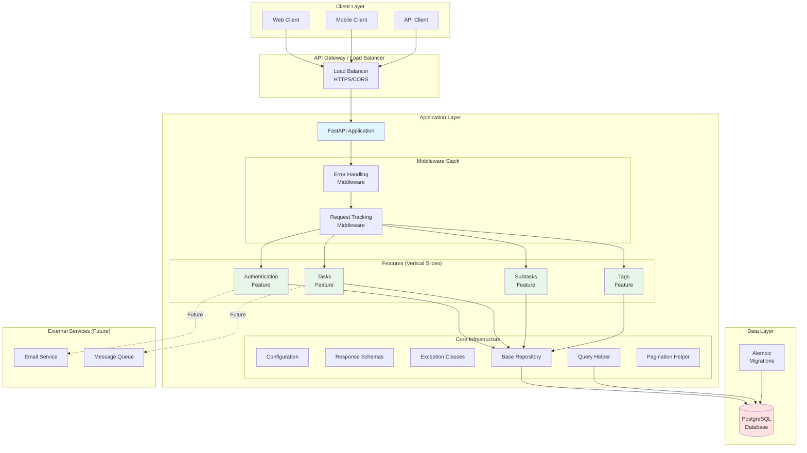

### 2.2 Vertical Slice Architecture

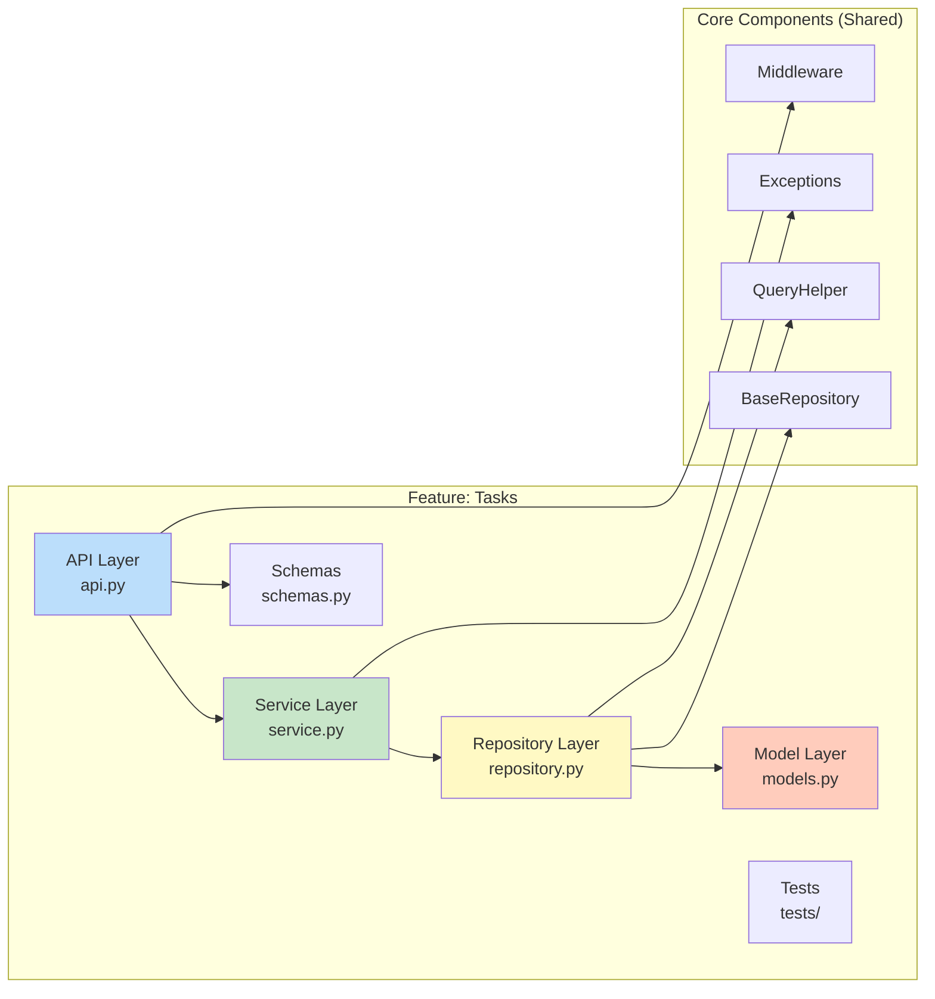

---

## 3. Request Flow

### 3.1 Complete Request Lifecycle

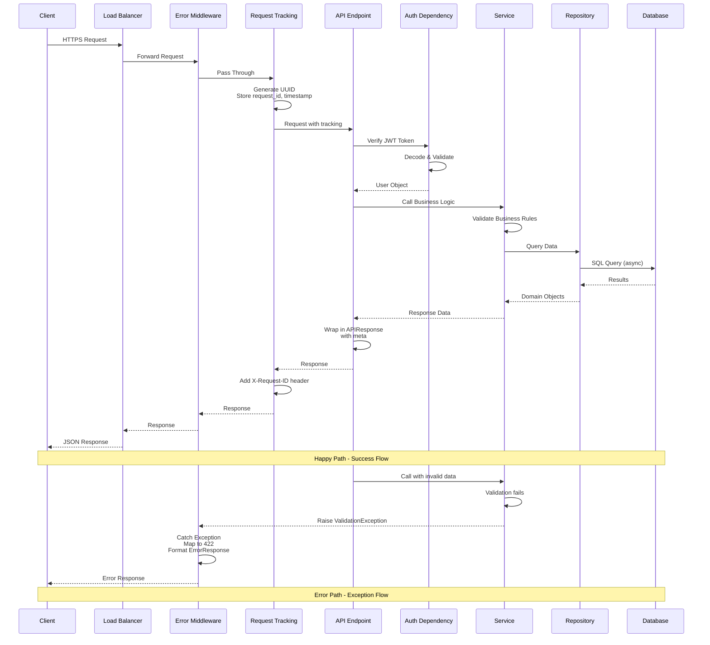

### 3.2 Layer Responsibilities

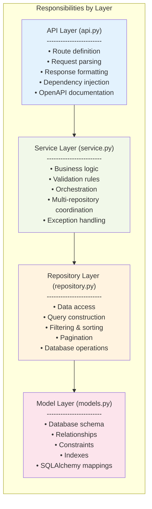

---

## 4. Database Design

### 4.1 Entity Relationship Diagram

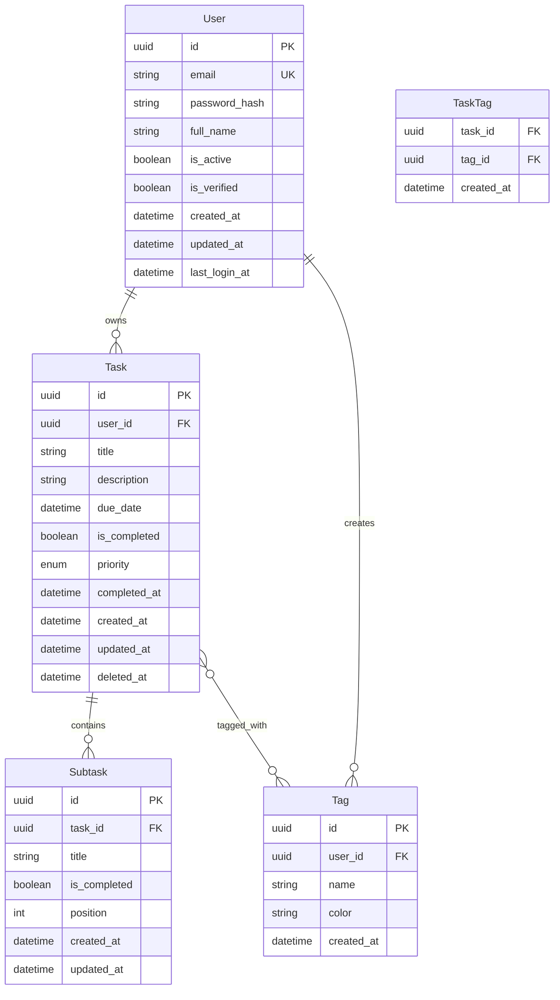

### 4.2 Database Constraints & Indexes

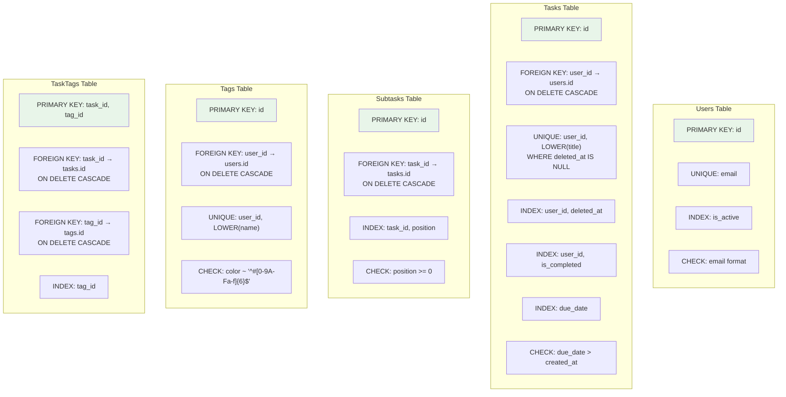

---

## 5. Authentication & Authorization

### 5.1 JWT Authentication Flow

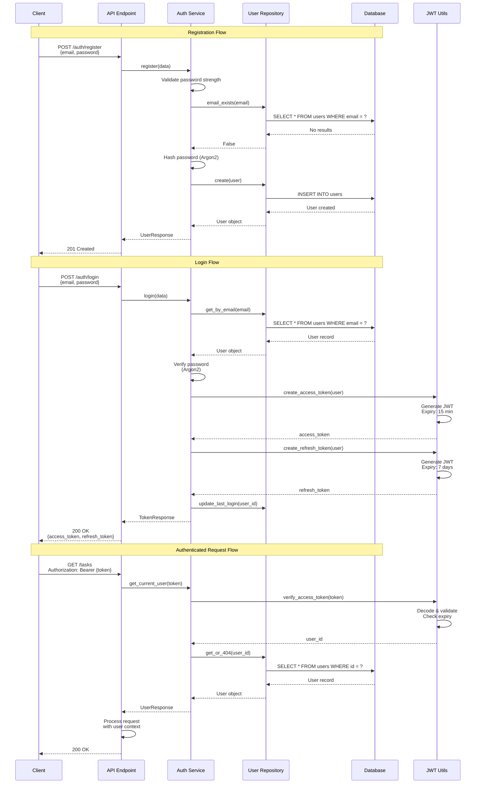

### 5.2 Token Structure

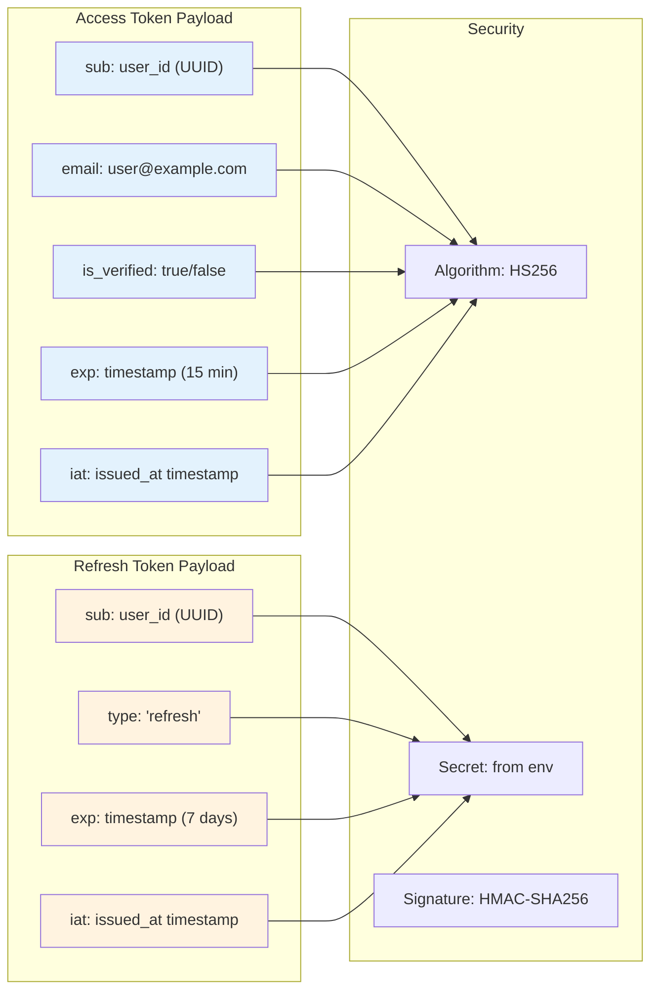

---

## 6. API Endpoint Organization

### 6.1 API Endpoint Tree

```mermaid
graph TD
    Root["/api/v1"]

    Root --> Auth["/auth"]
    Root --> Me["/me"]
    Root --> Tasks["/tasks"]
    Root --> Subtasks["/subtasks"]
    Root --> Tags["/tags"]
    Root --> Health["/health"]

    Auth --> AuthReg["POST /register"]
    Auth --> AuthLogin["POST /login"]
    Auth --> AuthRefresh["POST /refresh"]
    Auth --> AuthLogout["POST /logout"]

    Me --> MeGet["GET /"]
    Me --> MePatch["PATCH /"]
    Me --> MeDelete["DELETE /"]

    Tasks --> TasksList["GET /<br/>Query: filters, sort, page"]
    Tasks --> TasksCreate["POST /"]
    Tasks --> TasksID["{task_id}"]
    Tasks --> TasksDeleted["GET /deleted"]
    Tasks --> TasksOverdue["GET /overdue"]
    Tasks --> TasksToday["GET /today"]
    Tasks --> TasksUpcoming["GET /upcoming"]

    TasksID --> TaskGet["GET /"]
    TasksID --> TaskPatch["PATCH /"]
    TasksID --> TaskDelete["DELETE /"]
    TasksID --> TaskComplete["POST /complete"]
    TasksID --> TaskUncomplete["POST /uncomplete"]
    TasksID --> TaskRestore["POST /restore"]
    TasksID --> TaskSubtasks["POST /subtasks"]
    TasksID --> TaskTagsAdd["POST /tags/{tag_id}"]
    TasksID --> TaskTagsRemove["DELETE /tags/{tag_id}"]

    Subtasks --> SubtaskID["{subtask_id}"]
    SubtaskID --> SubtaskPatch["PATCH /"]
    SubtaskID --> SubtaskDelete["DELETE /"]

    Tags --> TagsList["GET /"]
    Tags --> TagsCreate["POST /"]
    Tags --> TagID["{tag_id}"]
    TagID --> TagPatch["PATCH /"]
    TagID --> TagDelete["DELETE /"]

    Health --> HealthLive["GET /live"]
    Health --> HealthReady["GET /ready"]

    style Root fill:#e1f5ff
    style Auth fill:#e8f5e9
    style Me fill:#e8f5e9
    style Tasks fill:#e8f5e9
    style Subtasks fill:#e8f5e9
    style Tags fill:#e8f5e9
    style Health fill:#fff9c4
```

### 6.2 Common Query Parameters

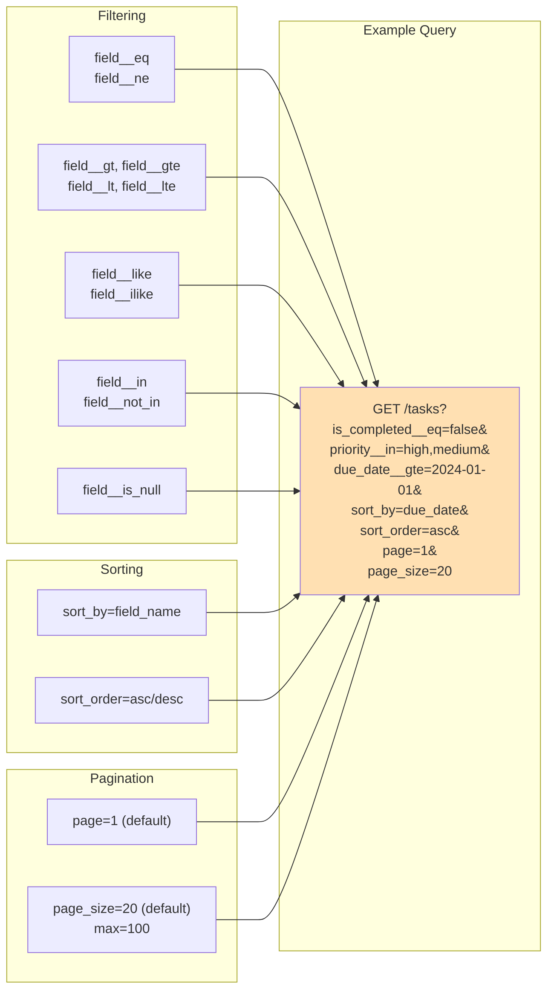

---

## 7. Core Patterns & Components

### 7.1 Repository Pattern with QueryHelper

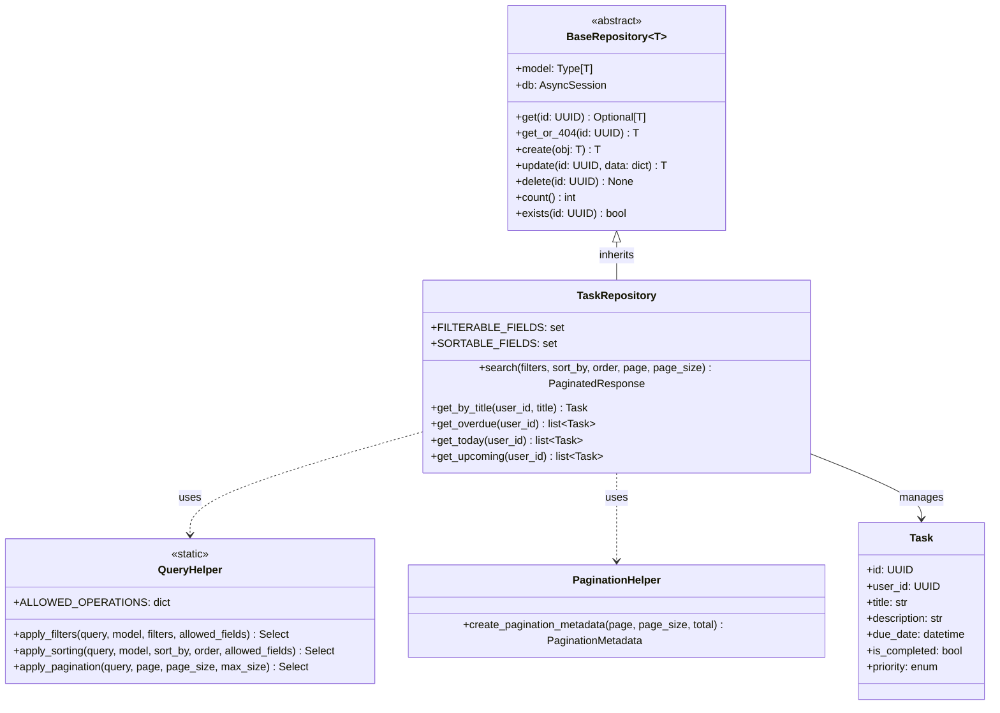

### 7.2 Service Layer Pattern

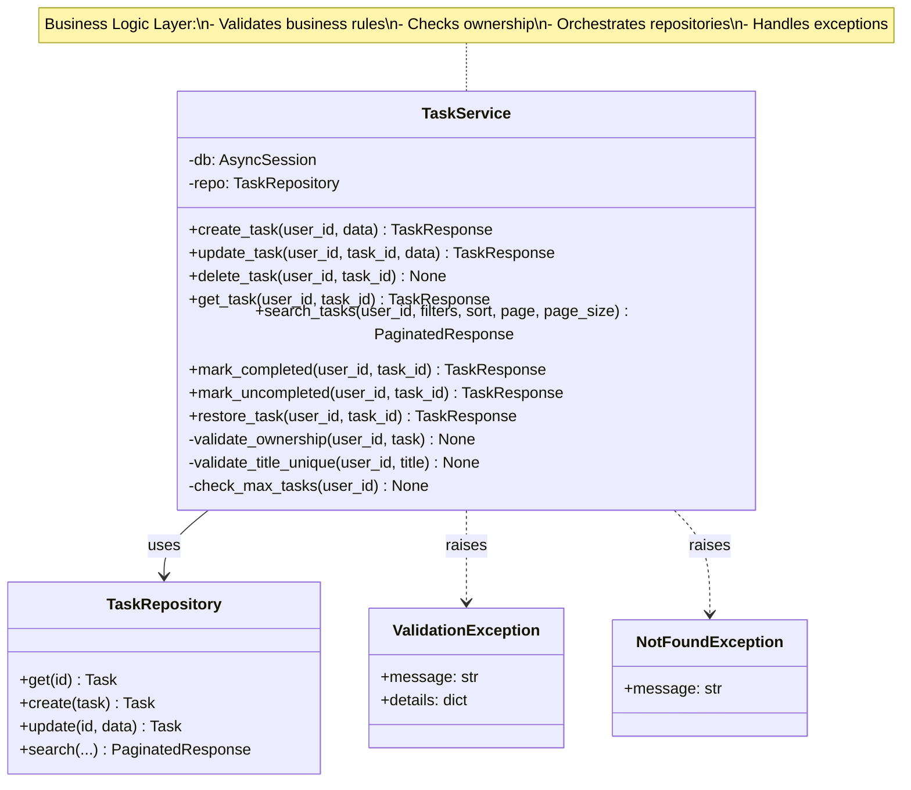

### 7.3 Middleware Stack

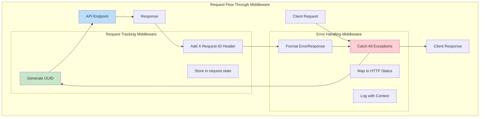

---

## 8. Data Flow Diagrams

### 8.1 Create Task Flow

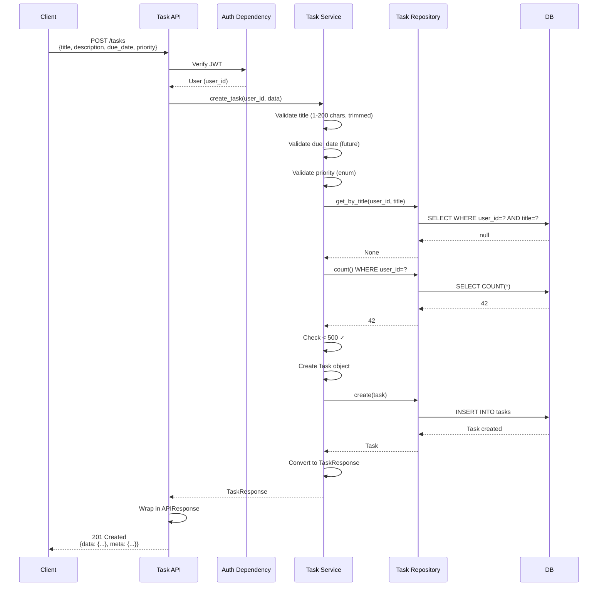

### 8.2 Search Tasks with Filtering Flow

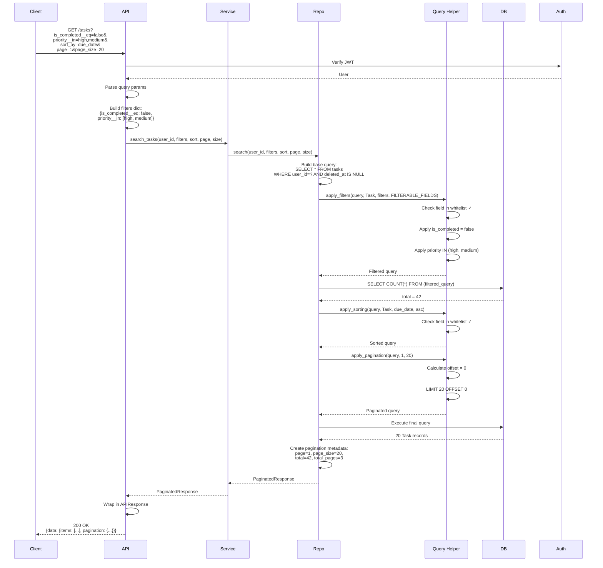

---

## 9. Error Handling Strategy

### 9.1 Exception Hierarchy

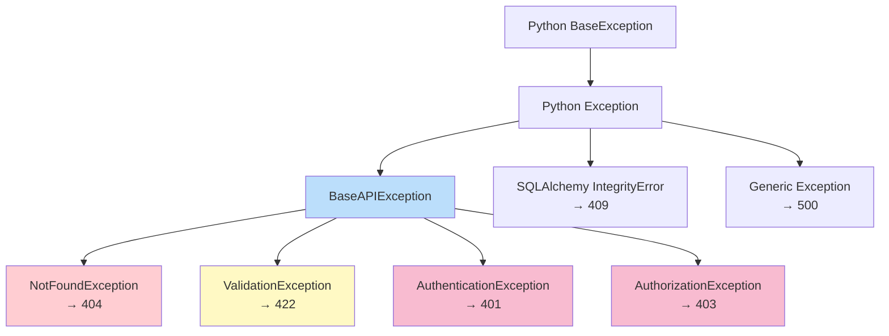

### 9.2 Error Response Flow

```mermaid
graph TB
    Start[Exception Raised]
    Catch[Error Middleware Catches]

    Start --> Catch

    Catch --> Check{Exception Type?}

    Check -->|NotFoundException| NF[404 NOT_FOUND]
    Check -->|ValidationException| VE[422 VALIDATION_ERROR]
    Check -->|AuthenticationException| AE[401 UNAUTHORIZED]
    Check -->|AuthorizationException| AZ[403 FORBIDDEN]
    Check -->|IntegrityError| IE[409 CONFLICT]
    Check -->|Other Exception| GE[500 INTERNAL_SERVER_ERROR]

    NF --> Format
    VE --> Format
    AE --> Format
    AZ --> Format
    IE --> Format
    GE --> Format

    Format[Format ErrorResponse]
    Format --> Log[Log Error with Context]
    Log --> Return[Return JSON Response]

    Return --> Client[Client receives:<br/>{error: {code, message, details}, meta: {...}}]

    style Check fill:#fff9c4
    style Format fill:#c8e6c9
    style Log fill:#ffccbc
```

---

## 10. Deployment Architecture

### 10.1 Container Architecture

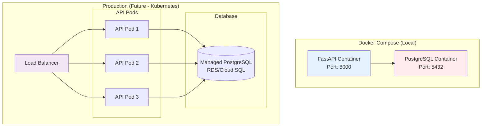

### 10.2 CI/CD Pipeline

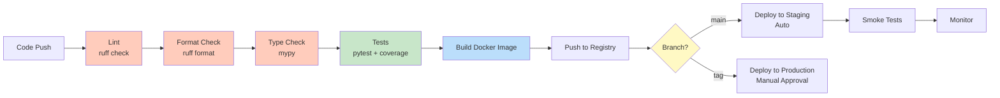

---

## 11. Security Architecture

### 11.1 Security Layers

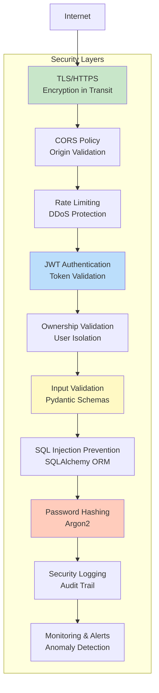

### 11.2 Data Access Control

```mermaid
graph LR
    subgraph "User A"
        UserA_Req[Request]
        UserA_JWT[JWT: user_id=A]
    end

    subgraph "User B"
        UserB_Req[Request]
        UserB_JWT[JWT: user_id=B]
    end

    subgraph "Service Layer"
        Service[Task Service]
        Check{user_id matches<br/>resource owner?}
    end

    subgraph "Database"
        TasksA[(Tasks<br/>user_id=A)]
        TasksB[(Tasks<br/>user_id=B)]
    end

    UserA_Req --> UserA_JWT
    UserA_JWT --> Service
    Service --> Check
    Check -->|Yes| TasksA
    Check -->|No| Error[403 Forbidden]

    UserB_Req --> UserB_JWT
    UserB_JWT --> Service
    Check -->|Yes| TasksB

    style Check fill:#fff9c4
    style Error fill:#ffcdd2
    style TasksA fill:#c8e6c9
    style TasksB fill:#c8e6c9
```

---

## 12. Performance Considerations

### 12.1 Database Optimization

```mermaid
graph TB
    subgraph "Query Optimization"
        Index[Proper Indexing<br/>Foreign keys, filters]
        NoN1[No N+1 Queries<br/>Use joinedload]
        Pool[Connection Pooling<br/>Size: 10, Overflow: 20]
        Async[Async Queries<br/>Non-blocking I/O]
    end

    subgraph "Application Optimization"
        Pagination[Mandatory Pagination<br/>Max 100 items]
        Whitelist[Field Whitelisting<br/>Prevent query injection]
        Cache[Caching Strategy<br/>Future: Redis]
    end

    subgraph "Monitoring"
        SlowQuery[Slow Query Logging]
        Metrics[Query Metrics<br/>Latency tracking]
    end

    Index --> NoN1
    NoN1 --> Pool
    Pool --> Async

    Pagination --> Whitelist
    Whitelist --> Cache

    Async --> SlowQuery
    Cache --> Metrics

    style Index fill:#c8e6c9
    style NoN1 fill:#c8e6c9
    style Pagination fill:#bbdefb
    style Cache fill:#fff9c4
```

### 12.2 Preventing N+1 Queries

```mermaid
graph LR
    subgraph "Bad: N+1 Query Pattern"
        Bad1[Query 1: Get all tasks]
        Bad2[Query 2: Get subtasks for task 1]
        Bad3[Query 3: Get subtasks for task 2]
        Bad4[Query N: Get subtasks for task N]

        Bad1 --> Bad2
        Bad2 --> Bad3
        Bad3 --> Bad4
    end

    subgraph "Good: Single Query with Join"
        Good1[Query 1: Get tasks with subtasks<br/>Using joinedload]
        Good2[All data loaded in 1-2 queries]

        Good1 --> Good2
    end

    style Bad1 fill:#ffcdd2
    style Bad2 fill:#ffcdd2
    style Bad3 fill:#ffcdd2
    style Bad4 fill:#ffcdd2
    style Good1 fill:#c8e6c9
    style Good2 fill:#c8e6c9
```

---

## 13. Testing Strategy

### 13.1 Test Pyramid

```mermaid
graph TB
    subgraph "Test Pyramid"
        E2E[End-to-End Tests<br/>Few, Critical Flows]
        Integration[Integration Tests<br/>API Endpoints + DB]
        Unit[Unit Tests<br/>Services, Repositories, Utils]
    end

    Unit --> Integration
    Integration --> E2E

    style E2E fill:#ffccbc
    style Integration fill:#fff9c4
    style Unit fill:#c8e6c9

    Note[Target: 80% Coverage<br/>TDD: Write tests first]
```

### 13.2 Test Isolation

```mermaid
sequenceDiagram
    participant Test
    participant Fixture as Test Fixture
    participant DB as Test Database
    participant App as FastAPI App

    Test->>Fixture: Request db_session
    Fixture->>DB: Create all tables
    Fixture->>DB: Begin transaction
    Fixture-->>Test: Session

    Test->>App: Make API request
    App->>DB: Execute queries
    DB-->>App: Results
    App-->>Test: Response

    Test->>Test: Assert results

    Test->>Fixture: Test complete
    Fixture->>DB: Rollback transaction
    Fixture->>DB: Drop all tables
    Fixture-->>Test: Cleanup done

    Note over Test,DB: Each test isolated<br/>No data persists
```

---

## 14. Key Design Decisions

### 14.1 Architectural Choices

| Decision | Choice | Rationale |
|----------|--------|-----------|
| **Architecture Pattern** | Vertical Slice | Feature isolation, easier to scale teams, clear boundaries |
| **ID Type** | UUID | Distributed-friendly, non-guessable, future-proof |
| **Pagination** | Page-based | User-friendly, common pattern, easier than offset |
| **Authentication** | JWT (stateless) | Scalable, no server-side session storage required |
| **Async/Sync** | Async (asyncio) | Better performance under load, non-blocking I/O |
| **Soft Delete** | Timestamp (deleted_at) | Data recovery, audit trail, user safety |
| **Error Handling** | Centralized Middleware | Consistent responses, separation of concerns |
| **Testing** | TDD | Quality assurance, regression prevention, living documentation |

### 14.2 Technology Choices

| Component | Technology | Rationale |
|-----------|-----------|-----------|
| **Web Framework** | FastAPI | Auto OpenAPI docs, async support, type hints, fast |
| **Database** | PostgreSQL | ACID compliance, mature, rich feature set, JSON support |
| **ORM** | SQLAlchemy 2.0 | Industry standard, async support, type safety with Mapped |
| **Password Hashing** | Argon2 | OWASP recommended, memory-hard, resistant to GPU attacks |
| **JWT Library** | python-jose | Lightweight, widely used, good documentation |
| **Validation** | Pydantic | FastAPI native, type safety, clear error messages |
| **Migrations** | Alembic | SQLAlchemy companion, autogenerate, version control |
| **Testing** | pytest | Fixtures, async support, parametrization, plugins |
| **Linting** | ruff | Fast (Rust-based), combines multiple tools, configurable |

---

## 15. Future Enhancements

### 15.1 Phase 2 Architecture Additions

```mermaid
graph TB
    subgraph "Phase 2 Additions"
        Queue[Message Queue<br/>Celery + Redis]
        Worker[Background Workers<br/>Reminders, Notifications]
        Email[Email Service<br/>SendGrid/SES]
        Search[Full-Text Search<br/>PostgreSQL FTS]
        Cache[Redis Cache<br/>User profiles, Tags]
        Metrics[Prometheus Metrics<br/>+ Grafana Dashboards]
    end

    API[FastAPI Application]
    DB[(PostgreSQL)]

    API --> Queue
    Queue --> Worker
    Worker --> Email
    Worker --> DB

    API --> Search
    Search --> DB

    API --> Cache

    API --> Metrics

    style Queue fill:#ffe0b2
    style Worker fill:#ffe0b2
    style Email fill:#ffe0b2
    style Search fill:#ffe0b2
    style Cache fill:#ffe0b2
    style Metrics fill:#ffe0b2
```

### 15.2 Phase 3 Architecture Additions

```mermaid
graph TB
    subgraph "Phase 3 Additions"
        WebSocket[WebSocket Server<br/>Real-time updates]
        Storage[Object Storage<br/>File attachments]
        Analytics[Analytics Service<br/>User behavior]
        AI[AI Service<br/>Task suggestions]
    end

    API[FastAPI Application]

    API --> WebSocket
    API --> Storage
    API --> Analytics
    API --> AI

    style WebSocket fill:#f3e5f5
    style Storage fill:#f3e5f5
    style Analytics fill:#f3e5f5
    style AI fill:#f3e5f5
```

---

## Appendix: Quick Reference

### Component Responsibilities

| Component | Primary Responsibility |
|-----------|----------------------|
| **API Layer** | HTTP interface, request/response handling, OpenAPI docs |
| **Service Layer** | Business logic, validation, orchestration, exception handling |
| **Repository Layer** | Data access, query construction, database operations |
| **Model Layer** | Database schema, relationships, constraints |
| **Middleware** | Cross-cutting concerns (logging, error handling, tracking) |
| **Schemas** | Data validation, serialization, API contracts |

### Critical Flows to Understand

1. **Authentication Flow** - Registration → Login → JWT → Authenticated requests
2. **Task Creation** - Validation → Ownership → Uniqueness → DB insert
3. **Task Search** - Auth → Filters → QueryHelper → Pagination → Response
4. **Error Handling** - Exception → Middleware → Status mapping → ErrorResponse
5. **Request Tracking** - UUID generation → Store in state → Return in response

### Key Files by Feature

- **Core**: `session.py`, `base_repository.py`, `query_helper.py`, `pagination.py`
- **Middleware**: `request_tracking.py`, `error_handling.py`
- **Auth**: `models.py`, `service.py`, `jwt.py`, `security.py`, `api.py`
- **Tasks**: `models.py`, `repository.py`, `service.py`, `api.py`

---

**End of High-Level Design Document**

This HLD serves as a comprehensive reference for understanding the system architecture, data flows, and design decisions. Use this in conjunction with the PRD (`ai/prd.md`) and architecture patterns (`CLAUDE.md`) for complete context.
